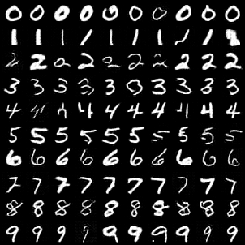
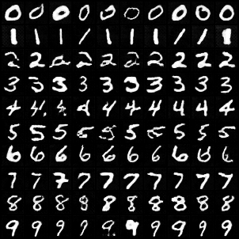
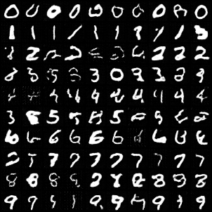
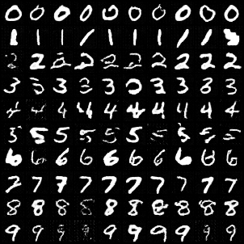
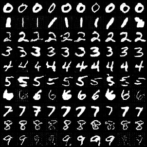

# PixelDiT: Unified Diffusion Transformers for Pixel-Level Generation (Unofficial)

This repository is an **unofficial reimplementation** of **PixelDiT** ([PixelDiT: Pixel-level Diffusion Transformer for Image Generation](https://arxiv.org/abs/2511.20645)). It provides a unified framework for training and sampling from both standard Diffusion Transformers (DiT) and PixelDiT models on datasets like MNIST and CIFAR10 using Rectified Flow, especially on pixel space. This repo is designed to be more than just an reimplementation of PixelDiT and include latest (up to this moment) tricks in diffusion models.This repo can be a good starting point for researchers and practitioners interested in diffusion models and DiT architectures.

## Features

- **Unofficial PixelDiT Implementation**: Based on the architecture described in [PixelDiT: Pixel Diffusion Transformers for Image Generation](https://arxiv.org/abs/2511.20645). Using learnable registers for Multi-modal version.
- **Flow Matching with $x_{pred}$ as Model Output**: Model output with flow matching objective introduced in [Back to Basics: Let Denoising Generative Models Denoise](https://arxiv.org/abs/2511.13720)
- **APE + RoPE**: Learnable Absolute Positional Encoding (APE) and Rotary Positional Encoding (RoPE) for positional information, following [ViT-5: Vision Transformers for The Mid-2020s](https://arxiv.org/abs/2602.08071)
- **Flexible Sampling**: Support for different sampling tricks like **timeshift** and **CFG Interval**.
- **Unified Training**: A single script to train both DiT and PixelDiT on multiple datasets.
- **Unified Sampling**: Automatic model and dataset detection from checkpoints.
- **Configuration System**: YAML-based configurations for models and datasets in [`configs/`](configs/).
- **Accelerate Support**: Built-in support for multi-GPU and mixed-precision training via Hugging Face `accelerate`.

## MNIST Result

Below is the sampling process of a PixelDiT model trained on the MNIST dataset, demonstrating the transition from noise to structured digits. The model is trained on a RTX4090 within 5 minutes. 

To reproduce the result, you can use the following command:
```bash
# Training (with bf16)
accelerate launch --mixed-precision bf16 pixel_dit/train.py --model {model_type} --dataset mnist --epochs 10 --checkpoint-every 5 --num-workers 20 --ema-decay 0.9

# Sampling
python pixel_dit/sample.py \
  --checkpoint {CKPT_PATH} \
  --num-samples 100 \
  --num-steps 10 \
  --cfg-scale 3.0 \
  --shift 1.0 \
  --cfg-interval 0.1 1.0 \
  --save-gif \
  --gif-path "./results/${MODEL_TYPE}_sample.gif" \
  --output "./results/${MODEL_TYPE}_sample.png"
```


### Model Ablation

| DiT | PixelDiT | MM-DiT | MM-PixelDiT |
| :---: | :---: | :---: | :---: |
|  |  |  |  |

### CFG Ablation (MM-PixelDiT)

| CFG 1.0 | CFG 3.0 | CFG 7.0 |
| :---: | :---: | :---: |
|  |  |  |

## Installation

```bash
conda activate pixeldit
pip install -e .
```

## Training

Use [`pixel_dit/train.py`](pixel_dit/train.py) to train models. The script automatically selects the correct configuration based on the `--model` and `--dataset` arguments.

### Examples

#### Train PixelDiT on MNIST
```bash
conda activate pixeldit && python pixel_dit/train.py --model pixeldit --dataset mnist
```

#### Train PixelDiT on CIFAR10
```bash
conda activate pixeldit && python pixel_dit/train.py --model pixeldit --dataset cifar10 --batch-size 64 --epochs 20
```

### Training Arguments

- `--model`: Model type (`dit` or `pixeldit`). Default: `dit`.
- `--dataset`: Dataset to use (`mnist` or `cifar10`). Default: `mnist`.
- `--epochs`: Number of training epochs.
- `--batch-size`: Batch size for training.
- `--lr`: Learning rate.
- `--resume`: Path to a checkpoint to resume training from.
- `--sample-every`: Generate samples every N steps.
- `--checkpoint-every`: Save checkpoint every N epochs.

## Sampling

Use [`pixel_dit/sample.py`](pixel_dit/sample.py) to generate images from trained checkpoints.

### Automatic Mode
The script can automatically detect the model type and dataset from the checkpoint metadata or filename.

```bash
conda activate pixeldit && python pixel_dit/sample.py --checkpoint checkpoints/pixeldit_mnist_epoch_10.pt
```

### Manual Override
If the checkpoint doesn't contain metadata or has a non-standard filename, you can specify the model and dataset manually.

```bash
conda activate pixeldit && python pixel_dit/sample.py --checkpoint path/to/checkpoint.pt --model pixeldit --dataset cifar10
```

### Sampling Arguments

- `--checkpoint`: (Required) Path to the model checkpoint.
- `--model`: Model type (`dit` or `pixeldit`). Auto-detected if not provided.
- `--dataset`: Dataset (`mnist` or `cifar10`). Auto-detected if not provided.
- `--num-samples`: Number of images to generate. Default: 16.
- `--num-steps`: Number of ODE steps for sampling. Default: 100.
- `--class-label`: Specific class label to sample (e.g., 5 for MNIST digit '5').
- `--cfg-scale`: Classifier-free guidance scale. Default: 3.0.
- `--output`: Custom output path for the generated image grid.
- `--seed`: Random seed for reproducibility.

## Project Structure

- [`pixel_dit/`](pixel_dit/): Core package containing model definitions, training, and sampling logic.
  - [`model.py`](pixel_dit/model.py:1): DiT and PixelDiT architectures.
  - [`train.py`](pixel_dit/train.py:1): Unified training script.
  - [`sample.py`](pixel_dit/sample.py:1): Unified sampling script.
  - [`config.py`](pixel_dit/config.py:1): Configuration management.
  - [`utils.py`](pixel_dit/utils.py:1): Utility functions for model creation and data loading.
- [`configs/`](configs/): YAML configuration files.
  - [`models/`](configs/models/): Model-specific hyperparameters.
  - [`datasets/`](configs/datasets/): Dataset-specific settings.

## Acknowledgement
This project is inspired by the official repo of [JiT](https://github.com/LTH14/JiT/tree/main) by Kaiming Xie and [rectified-flow-pytorch](https://gitlab.com/lucidrains/rectified-flow-pytorch) by lucidrains.